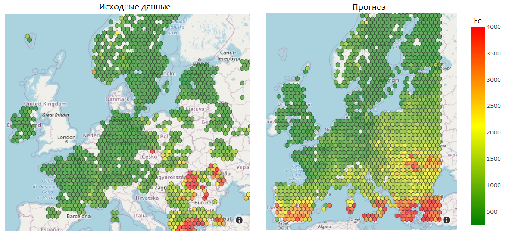

## Прогнозировнаие загрязнения воздуха тяжелыми металлами используя космоснимки🛰️и машинное обучение✨
[Исследование основано на данной работе](https://www.researchgate.net/publication/341956017_Mosses_as_biomonitors_of_air_pollution_20152016_survey_on_heavy_metals_nitrogen_and_POPs_in_Europe_and_beyond)

### Существующие решения 🗺️
Наиболее распространенным методом оценки состояния окружающей среды является определение количества мелкодисперсных частиц и некоторых химических соединений, например, CO2. Для получения подробной информации о составе загрязнения используются методы мониторинга, основанные на сборе проб.

### Мхи - биомонитор 🌿
Идея использования мхов для измерения атмосферных выпадений тяжелых металлов ос-нована на том факте, что мхи, получают большую часть микроэлементов и питательных ве-ществ непосредственно из атмосферы, при этом поглощение металлов из почвы невелико за счет поверхностного расположения корневой системы.

### Сбор мхов 🧑‍🔬⛺🔬
В рамках проекта комиссии Организации Объединенных Наций (ООН) дальнему транс-граничному переносу воздушных загрязнений (ICP Vegetation) участники собирают образцы мха и используют различные техники, например нейтронно-активационный анализ, чтобы получить данные по содержанию тяжелых металлов, соединений азота, стойких органиче-ских соединений и радионуклидов.

### Преимущества прогнозирования ✅
Поскольку стандартные методы мониторинга основаны на отборе проб и дальнейшем их анализе, они требуют больших временных и трудовых затрат для прогнозирования в гло-бальных масштабах, также, при таком подходе сложно получать образцы в труднодоступных зонах. Поэтому хорошим дополнением может стать прогнозирование, оно позволит частично автоматизировать процесс контроля окружающей среды.

### Пайплайн 💡
Общая идея состоит в использова-нии данных, которые можно получать со спутниковых изображений вместе с данными, полученными после анализа собранных образцов, чтобы обучить модель, а затем использовать только данные со спутниковых изображений для дальнейшего анализа концентрации тяже-лых металлов.

### Визуализация прогнозирования ✨
Точность прогнозирования (accuracy) 81% (triplet loss)

